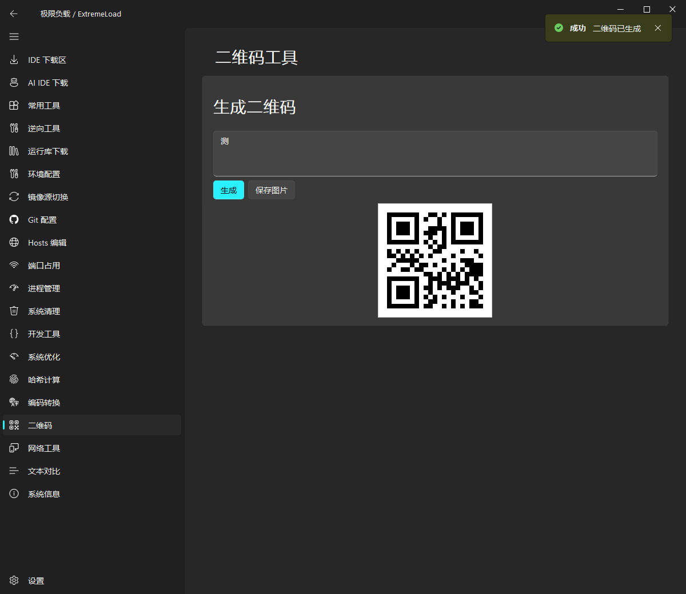
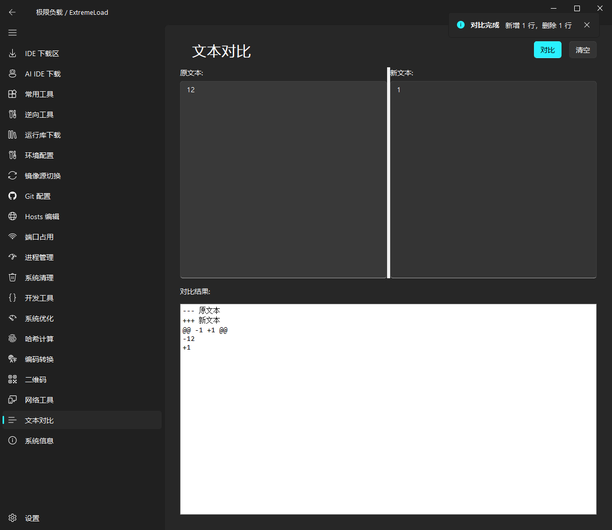

# 🚀 极限负载 / ExtremeLoad

开发者工具箱，让开发准备工作一键搞定。

## 功能模块

### 📥 IDE 下载区
一键下载常用开发工具，支持多版本选择：
- Visual Studio Code、Visual Studio 2022
- Python (3.10/3.11/3.12)、Node.js (18/20/22)
- Git、JDK (17/21)、Go、Rust
- IntelliJ IDEA、PyCharm

### 🤖 AI IDE 下载
- Kiro (AWS)
- Windsurf (Codeium)

### 🛠️ 常用工具
- Postman、Apifox - API 调试
- DBeaver - 数据库管理
- Docker Desktop - 容器化
- Notepad++、7-Zip、Everything、Snipaste

### 🔍 逆向工具
免费开源的逆向工程工具：
- Cheat Engine - 内存扫描修改
- x64dbg - 开源调试器
- Ghidra - NSA 逆向框架
- dnSpy - .NET 反编译
- Detect It Easy - 查壳工具
- PE-bear - PE 分析
- Process Hacker - 进程管理
- API Monitor - API 监控

### 📚 运行库下载
- Visual C++ 运行库 (2005-2022, x86/x64)
- .NET Framework (4.0/4.5/4.8)
- msvsmon 远程调试器
- 一键下载全部 VC++ 运行库
- 一键静默安装已下载

### ⚙️ 环境配置
一键配置开发环境变量：
- JAVA_HOME、GOROOT、GOPATH
- PYTHON_HOME、NODE_HOME、MAVEN_HOME
- 自动检测已安装软件路径

### 🔄 镜像源切换
国内镜像源一键切换：
- npm (淘宝源、腾讯源、华为源)
- pip (清华源、阿里源、腾讯源)
- Maven (阿里源、华为源)
- Go Proxy (七牛源、阿里源)

### 🔧 Git 配置
- 用户信息配置 (user.name、user.email)
- 代理配置 (http.proxy、https.proxy)
- 常用配置 (autocrlf、credential.helper)
- SSH 密钥生成

### 🌐 系统工具
- Hosts 编辑器 - 可视化编辑、快捷预设
- 端口占用查看 - 查看端口、结束进程
- 进程管理 - 查看/结束进程、打开文件位置
- 系统清理 - 临时文件、缓存、日志清理

### 🔨 开发工具
- UUID 生成器 - UUID1/UUID4
- 密码生成器 - 自定义长度和字符类型
- API 测试 - HTTP 请求测试
- 数据库连接测试 - MySQL/Redis/MongoDB

### ⚡ Windows 优化
- 系统激活状态检测
- 防火墙开关
- 电源计划切换
- Windows 功能开关 (Hyper-V、WSL)
- 网络重置、DNS 刷新

### 🔧 实用工具
- 文件哈希计算 (MD5/SHA1/SHA256)
- 编码转换 (Base64/URL/JSON/HTML)
- 二维码生成
- 文本对比

### 🌐 网络工具
- IP 查询 (本机/公网)
- Ping / Traceroute
- DNS 查询
- 网络测速

### 📊 系统信息
- 操作系统信息
- 已安装开发环境版本检测
- 环境变量状态查看

### ⚡ 设置
- 主题切换 (深色/浅色)
- 网络代理配置
- 默认下载目录设置

## 技术栈

- Python 3.10+
- PyQt5
- PyQt-Fluent-Widgets (Fluent Design UI)

## 安装

```bash
pip install -r requirements.txt -i https://pypi.tuna.tsinghua.edu.cn/simple
```

## 运行

```bash
python main.py
```

## 截图






## 许可证

MIT License
